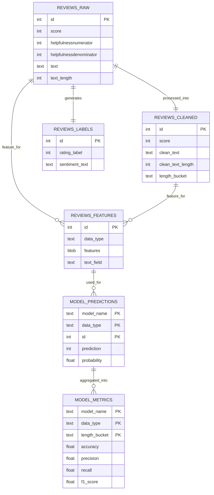

# 📊 Comparative Sentiment Analysis using Apache Spark MLlib

---

## Nhóm thực hiện

| Thành viên (Họ và tên + MSSV) | Vai trò/Nhiệm vụ |
|-------------------------------|------------------|
| Trần Anh Đức – A44170         | All              |

---

## 1. Giới thiệu đề tài

**Tên đề tài:** Comparative Sentiment Analysis on Reviews using Apache Spark MLlib  

**Mục tiêu:** So sánh hiệu quả của các mô hình MLlib khi phân tích sentiment trên review text, so sánh dữ liệu **thô (raw)** và **đã làm sạch (clean)**.  

**Công nghệ:**
- Apache Spark (DataFrame + MLlib)
- Cassandra (NoSQL phân tán)
- Python (pandas, matplotlib, seaborn) cho trực quan hóa
- Docker để triển khai môi trường thống nhất

---

## 2. Mục tiêu

- Chạy tất cả mô hình MLlib: Logistic Regression, Naive Bayes, Decision Tree, Random Forest, GBT.  
- Đánh giá **Accuracy, Precision, Recall, F1-score** cho từng mô hình.  
- So sánh hiệu quả **dữ liệu raw vs clean**.  
- Phân tích ảnh hưởng của **độ dài review** đến hiệu quả mô hình.  
- Trực quan hóa kết quả bằng biểu đồ PNG và HTML.

---

## 3. Chuẩn bị dữ liệu

**Nguồn:** Amazon Fine Food Reviews Dataset (hoặc dataset tương tự).  

**Lưu trữ:** Cassandra Keyspace `reviews_ks` với các bảng:
- `reviews_raw`
- `reviews_cleaned`
- `reviews_labels`
- `model_predictions`
- `model_metrics`

---

## 4. Tiền xử lý dữ liệu

**Các bước:**
1. Loại bỏ ký tự đặc biệt và HTML tags.  
2. Chuyển text về lowercase.  
3. Tính toán độ dài review (`text_length`).  
4. Gán bucket độ dài (`short`, `medium`, `long`) để phân tích metrics theo độ dài.

---

## 5. Pipeline phân tích bằng Spark MLlib

### 5.1 Workflow tổng thể
```text
Raw CSV → Cassandra → Data Cleaning (Spark)
    ↓
Read Data → Tokenizer → StopWords → TF-IDF
    ↓
Run MLlib Models (LR, NB, DT, RF, GBT)
    ↓
Evaluate metrics: Accuracy, Precision, Recall, F1
    ↓
Aggregate metrics theo model, data_type, length_bucket
    ↓
Visualize results (Bar/Line chart)
```

### 5.2 Metrics đánh giá

* Accuracy
* Precision
* Recall
* F1-score
* Phân tích theo **length_bucket**: short / medium / long

---

## 6. Trực quan hóa kết quả

**Biểu đồ:**

| Biểu đồ         | Mục đích                                                 |
| --------------- | -------------------------------------------------------- |
| Bar chart       | So sánh Accuracy, Precision, Recall, F1 giữa các mô hình |
| Multi-bar chart | So sánh clean vs raw                                     |
| HTML dashboard  | Tổng hợp tất cả PNG vào một file dễ mở                   |

---

## 7. Hướng dẫn chạy dự án

### 7.1 Khởi tạo môi trường Docker

```bash
docker compose up -d
```

### 7.2 Truy cập môi trường

```bash
docker compose exec cassandra cqlsh
docker compose exec python bash
```

---

## 8. Sơ đồ dữ liệu (ERD)



---

* Tất cả scripts đều chạy tự động trong Docker, đảm bảo reproducible environment.
